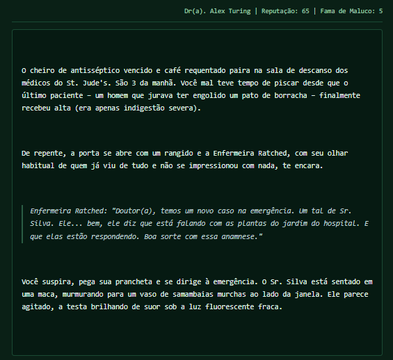
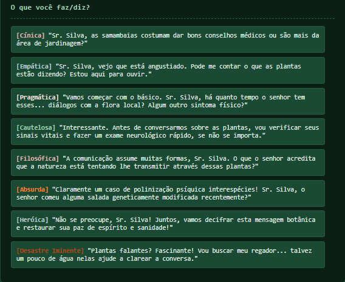

# Anamnese
**(Protótipo: "Plantão 24h: O Mistério do Paciente X")**

  <em>Um RPG textual médico investigativo onde cada diagnóstico é um mistério e cada escolha é gerada pela IA Gemini.</em>

  

## 🏥 Sobre o Jogo: Um Desafio da Imersão I.A. Alura!

**Anamnese** (originalmente "Plantão 24h: O Mistério do Paciente X") nasceu como um projeto para a **Imersão I.A. com Google Gemini**, uma iniciativa da Alura e do Google.

Mergulhe em um hospital decadente como um(a) médico(a) recém-chegado(a). Sua missão? Desvendar casos clínicos bizarros e intrigantes, onde cada interação e reviravolta é moldada dinamicamente pela inteligência artificial Gemini. Inspirado em RPGs narrativos como *Disco Elysium*, prepare-se para uma experiência única a cada plantão!

---

## 🎮 Gameplay Dinâmico com IA Gemini

A essência de **Anamnese** está na sua rejogabilidade e na forma como a IA cria a sua jornada:

* **Sua Identidade Médica Importa:** A combinação da sua Classe (especialidade) com seu Traço (personalidade) não é só um detalhe. Ela define suas habilidades passivas, como você percebe pistas e, crucialmente, as opções de ação e diálogo disponíveis.
* **8 Opções de Cena Geradas pela IA:** Em cada ponto chave da investigação, a IA Gemini apresenta 8 opções de ação ou diálogo, cada uma com um tom distinto para você escolher:
    * **Cínica:** ("Claro, sua 'dor nas costas' é definitivamente um tumor.")
    * **Empática:** ("Vamos fazer todos os exames para te tranquilizar.")
    * **Pragmática:** ("Cortar agora é a única opção. Assine aqui." - Ex: Cirurgião)
    * **Cautelosa:** ("Vou repetir o ecocardiograma 3 vezes." - Ex: Cardiologista)
    * **Filosófica:** ("A dor é real... mas e a realidade?" - Ex: Psicólogo)
    * **Absurda:** ("Isso é claramente um ataque de répteis illuminati!" - Ex: Teórico da Conspiração)
    * **Heróica:** ("Vamos derrotar a bactéria maligna, soldado!" - Ex: Pediatra)
    * **Desastre Iminente:** ("Aplicar injeção... quebra a agulha." - Ex: Desastrado)

    A escolha é sua, e as consequências também!

---

## 🚑 Exemplo de Caso: "Homem diz que engoliu um Bluetooth."

* **Médico:** Enfermeiro (descarta pista falsa) + Traço Curioso (perguntas inesperadas).
* **Situação:** Paciente em pânico alega ter engolido um fone Bluetooth e se queixa de dor abdominal.
* **Desfecho Possível:** Sua curiosidade leva a perguntas que detalham melhor a dor. Ao pedir um Raio-X (uma opção pragmática gerada pela IA), você não só encontra o fone, mas descobre uma apendicite aguda que era a real emergência!

---

## 🛠️ Tecnologias Utilizadas

* **Backend:** Python com Flask (ou FastAPI)
* **Inteligência Artificial:** Google Gemini API
* **Frontend (Protótipo Web):** HTML, CSS, JavaScript
* **Ambiente de Prototipagem Inicial:** Google Colab
* **Controle de Versão:** Git e GitHub

---

## 📋 Pré-requisitos para Testar (Versão Web Local com Backend Python)

* Python 3.8 ou superior instalado.
* Gerenciador de pacotes `pip`.
* Um navegador web moderno.
* Uma chave de API válida do Google Gemini (configurada como variável de ambiente `GOOGLE_API_KEY_RPG` para execução local).
* (Opcional) Git para clonar o repositório.

*As dependências Python (Flask, google-generativeai) podem ser instaladas via `pip install -r requirements.txt` (se fornecido).*

---

## 🩺 Como o Projeto Ajuda Pessoas Fora da Área da Saúde

Este jogo RPG médico não é apenas entretenimento – é uma **ferramenta de educação e conscientização** que beneficia jogadores leigos de várias formas:

### 📚 Aprendizado Prático e Acessível

O jogo simplifica conceitos médicos complexos através de cenários interativos.

| Benefício para o Leigo                | Exemplo no Jogo                                                                                                                               |
| :------------------------------------ | :-------------------------------------------------------------------------------------------------------------------------------------------- |
| **Entender Sintomas Comuns** | Aprender a diferenciar sinais de um possível infarto (ex: dor no peito irradiando, sudorese fria) de uma crise de ansiedade.                  |
| **Tomar Melhores Decisões em Emergências** | Um caso sobre febre persistente com manchas na pele pode ensinar sobre sinais de alerta para condições como dengue e a importância de buscar ajuda. |
| **Desmistificar Terminologia Médica** | Durante um caso de infecção grave, o jogo pode explicar de forma lúdica o que é "sepse" ou, em um caso de pressão alta, "hipertensão".        |

### 🧠 Desenvolvimento de Habilidades Essenciais

Além do conhecimento médico, o jogo estimula habilidades valiosas:

| Habilidade Desenvolvida        | Aplicação no Jogo                                                                                                | Impacto na Vida Real                                                                         |
| :----------------------------- | :--------------------------------------------------------------------------------------------------------------- | :------------------------------------------------------------------------------------------- |
| **Pensamento Crítico** | Analisar informações contraditórias de pacientes, resultados de exames e pistas falsas para chegar a um diagnóstico. | Melhor capacidade de avaliar informações e riscos em situações cotidianas.                 |
| **Empatia e Comunicação** | Escolher opções de diálogo para lidar com pacientes virtuais ansiosos, assustados ou hostis.                         | Maior compreensão sobre os desafios da comunicação na área da saúde e postura mais empática. |
| **Gestão de Estresse e Decisão** | Alguns casos podem ter elementos de tempo ou consequências graves, simulando a pressão do ambiente médico.         | Melhor preparo emocional para lidar com emergências e tomar decisões ponderadas.             |

---

## ✨ Pontos Positivos do Projeto "Anamnese"

1.  **Democratização do Conhecimento Médico:**
    * *Como:* Ensina conceitos complexos através de casos divertidos (ex.: diferença entre virose e bactéria).
    * *Impacto:* População mais informada para prevenir doenças, evitar automedicação e comunicar-se melhor com profissionais.
2.  **Combate à Desinformação e ao "Dr. Google":**
    * *Problema Atual:* Buscas online geram ansiedade e autodiagnósticos errados.
    * *Solução do Jogo:* Mostra como sintomas similares podem ter causas distintas (ex.: dor de cabeça = estresse? Tumor? Desidratação?).
3.  **Promoção da Saúde Preventiva e Hábitos Saudáveis:**
    * *Mecânica:* Casos destacam a importância de check-ups, vacinação e hábitos saudáveis (ex.: um caso sobre diabetes tipo 2 ensina sobre dieta).
4.  **Conscientização sobre Saúde Mental de Forma Integrada:**
    * *Exemplo:* Paciente com ataques de pânico pode ser confundido com problemas cardíacos, ensinando a diferenciar e a importância da saúde mental.

---

## 🚀 Impacto Social Potencial do Jogo

**Anamnese** pode ser uma ferramenta valiosa para diversos públicos:

| Público-Alvo             | Benefício Específico com o Jogo                                                                                          |
| :----------------------- | :----------------------------------------------------------------------------------------------------------------------- |
| **Pais e Mães** | Aprender a identificar sinais de alerta em doenças comuns da infância.                                                   |
| **Cuidadores de Idosos** | Reconhecer sintomas iniciais de condições como AVC ou demência.                                                          |
| **Professores** | Ganhar confiança para agir em pequenas emergências escolares.                                                            |
| **Jovens e Adolescentes**| Entender de forma engajadora riscos de DSTs, uso de substâncias ou a importância da saúde mental.                        |

---

## 🎬 Visualizando a Experiência em Anamnese

A interface do jogo busca ser imersiva e focada na narrativa, com as opções de diálogo sendo centrais para a progressão.

### Tela de Narrativa e Diálogo:

 *Descrição da cena e diálogo com o paciente/NPCs, gerado pela IA Gemini.*

### Tela de Opções do Jogador:

 *As 8 opções de ação/diálogo com tons distintos geradas pela IA para o jogador escolher.*

*(Outros elementos visuais como um fluxograma conceitual de decisões e exemplos de telas de "Fim de Plantão" bem-humoradas podem ser adicionados para enriquecer a apresentação.)*

---

## 💡 Conclusão: Medicina Interativa e Consciente

**Anamnese** visa transformar o aprendizado sobre saúde em uma jornada interativa e cativante. Ao tecer drama médico, humor e educação sutil, o projeto busca:

* 👩‍⚕️ **Empoderar cidadãos** com informações práticas para o autocuidado.
* ⚕️ **Reduzir mitos e desinformação** perigosos sobre saúde.
* 🎮 **Engajar através da narrativa**, tornando o aprendizado mais atraente.

É um passo em direção a uma maior literacia em saúde e a uma relação mais colaborativa entre pacientes e profissionais! 🏥💙

---

  Projeto desenvolvido para a Imersão I.A. da Alura e Google.

